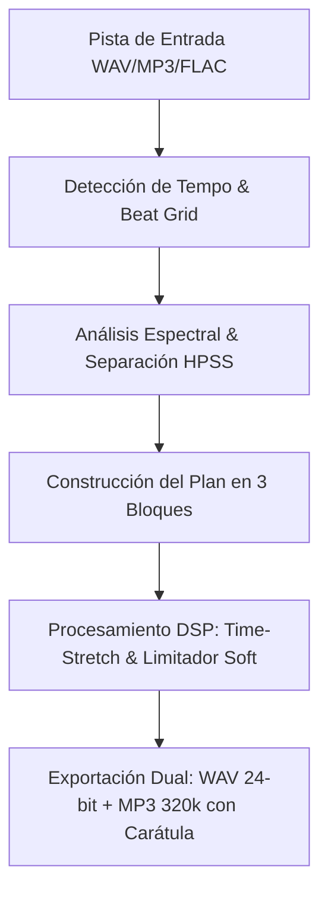

<div align="center">
  

  # AutoPrevias
  ### Sistema Automatizado e Inteligente de Generación de Previas Musicales de Estudio

  [](https://github.com/borjacandeel/auto-previas/releases/latest)
  [](https://github.com/borjacandeel/auto-previas/releases)
  [](https://www.python.org/)
  [](https://www.qt.io/)
  [](https://github.com/borjacandeel/auto-previas/actions)
  [](THIRD_PARTY_LICENSES.txt)

  <p align="center">
    <strong>Software exclusivo para Radical Records.</strong><br>
    Automatiza la selección quirúrgica de segmentos, drops, subidas y descansos musicales para generar previas promocionales de máxima energía acústica, transiciones naturales y perfecta alineación de compases.
  </p>
</div>

---

## 📑 Tabla de Contenidos
1. [📥 Descargas y GitHub Releases](#-descargas-y-github-releases)
   - [Enlaces de Descarga Directa (Última Versión)](#-enlaces-de-descarga-directa-última-versión)
   - [Historial de Releases por Versión en GitHub](#-historial-de-releases-por-versión-en-github)
   - [Comprobación de Integridad Criptográfica (SHA-256)](#-comprobación-de-integridad-criptográfica-sha-256)
2. [🚀 Guía de Instalación Paso a Paso](#-guía-de-instalación-paso-a-paso)
   - [Instalación en macOS (Apple Silicon arm64)](#-instalación-en-macos)
   - [Instalación en Windows (10 y 11 de 64 bits)](#-instalación-en-windows)
3. [✨ Características Principales](#-características-principales)
4. [🎧 Funcionamiento del Motor Acústico](#-funcionamiento-del-motor-acústico)
5. [🏷️ Política de Versionado (SemVer) e Historial](#-política-de-versionado-semver-e-historial)
6. [🛠️ Guía de Desarrollo y Compilación Local](#️-guía-de-desarrollo-y-compilación-local)
7. [💻 Requisitos del Sistema](#-requisitos-del-sistema)
8. [⚖️ Licencias y Componentes de Terceros](#️-licencias-y-componentes-de-terceros)
9. [✉️ Soporte Técnico y Contacto](#️-soporte-técnico-y-contacto)

---

## 📥 Descargas y GitHub Releases

AutoPrevias se distribuye mediante instaladores precompilados y optimizados para cada sistema operativo, sin necesidad de tener Python ni herramientas de desarrollo instaladas en tu equipo.

### 📦 Enlaces de Descarga Directa (Última Versión)

Los siguientes enlaces apuntan **siempre y de forma automática a los instaladores de la última versión estable (Release Latest)** disponible en GitHub:

| Plataforma | Arquitectura | Tipo de Paquete | Enlace de Descarga Directa | Notas de Versión |
| :--- | :--- | :--- | :--- | :--- |
| 🍏 **macOS** | **Apple Silicon (M1 / M2 / M3 / M4)** | Imagen de disco `.dmg` (Drag-to-Applications) | [⬇️ **Descargar AutoPrevias macOS arm64**](https://github.com/borjacandeel/auto-previas/releases/latest/download/AutoPrevias-macOS-arm64.dmg) | [Ver Release Oficial](https://github.com/borjacandeel/auto-previas/releases/latest) |
| 🪟 **Windows** | **64-bit (x64)** | Instalador Asistido `.exe` (Inno Setup) | [⬇️ **Descargar AutoPrevias Windows x64**](https://github.com/borjacandeel/auto-previas/releases/latest/download/AutoPrevias-Windows-x64-Setup.exe) | [Ver Release Oficial](https://github.com/borjacandeel/auto-previas/releases/latest) |

---

### 🏷️ Historial de Releases por Versión en GitHub

Para acceder a versiones anteriores, binarios específicos o al histórico de etiquetas (tags), puedes visitar el apartado oficial en el repositorio de GitHub:

👉 **[Ir al Apartado Oficial de Releases en GitHub](https://github.com/borjacandeel/auto-previas/releases)**

En dicha sección de GitHub encontrarás:
1. **Etiquetas por versión (Tags):** Cada publicación está catalogada siguiendo el estándar *Semantic Versioning* (`v1.0.1`, `v1.1.0`, etc.).
2. **Desplegable de Assets (Archivos adjuntos):**
   - `AutoPrevias-macOS-arm64.dmg`: Instalador para Mac con procesadores Apple Silicon (M1/M2/M3/M4).
   - `AutoPrevias-Windows-x64-Setup.exe`: Instalador ejecutable asistido para Windows 10/11 (64 bits).
   - `SHA256SUMS.txt`: Archivo de texto con las sumas de verificación criptográficas oficiales de cada instalador.
3. **Registro de cambios (Release Notes):** Resumen detallado con las correcciones, mejoras y novedades incluidas en cada compilación.

---

### 🔒 Comprobación de Integridad Criptográfica (SHA-256)

Cada release incluye un archivo `SHA256SUMS.txt` generado automáticamente durante la compilación en GitHub Actions. Puedes comprobar que el archivo que has descargado es auténtico y no se ha corrompido durante la descarga:

- **En macOS (Terminal):**
  ```bash
  shasum -a 256 ~/Downloads/AutoPrevias-macOS-arm64.dmg
  ```
- **En Windows (PowerShell):**
  ```powershell
  Get-FileHash -Algorithm SHA256 "$HOME\Downloads\AutoPrevias-Windows-x64-Setup.exe"
  ```
El valor hexadecimal devuelto debe coincidir exactamente con el hash publicado en el archivo `SHA256SUMS.txt` de la release.

---

## 🚀 Guía de Instalación Paso a Paso

### 🍏 Instalación en macOS

1. Descarga el archivo de imagen de disco `.dmg` para Apple Silicon (`AutoPrevias-macOS-arm64.dmg`).
2. Haz doble clic en el archivo `.dmg` descargado para montar la imagen de disco.
3. En la ventana emergente, arrastra el icono de **AutoPrevias** a la carpeta de **Aplicaciones**.
4. Expulsa la imagen de disco desde el Finder o el Escritorio.

#### 🛡️ Primera Apertura en macOS (Aviso de Desarrollador No Identificado / Gatekeeper)
Dado que AutoPrevias es un software de uso privado interno del sello y no cuenta por el momento con el certificado comercial anual de Apple Developer Program ($99/año), macOS activará la protección de cuarentena Gatekeeper en el primer arranque.

Existen dos métodos sencillos para autorizar la aplicación:

- **Método Rápido por Terminal (Recomendado):**
  Abre la aplicación **Terminal** (cmd + espacio, escribe *Terminal*) y ejecuta el siguiente comando:
  ```bash
  xattr -cr /Applications/AutoPrevias.app
  ```
  *(Este comando retira la marca de cuarentena de descarga y la aplicación se abrirá instantáneamente con un doble clic).*

- **Método desde Ajustes del Sistema:**
  1. Abre `/Applications/AutoPrevias.app`.
  2. Aparecerá el mensaje indicando que el desarrollador no ha podido ser verificado. Pulsa **Cancelar**.
  3. Dirígete a **Ajustes del Sistema > Privacidad y seguridad**.
  4. Baja hasta la sección **Seguridad**. Verás un aviso que indica: *"Se bloqueó el uso de AutoPrevias..."*.
  5. Haz clic en **Abrir de todos modos** e introduce tu contraseña o Touch ID.

---

### 🪟 Instalación en Windows

1. Descarga el instalador asistido **`AutoPrevias-Windows-x64-Setup.exe`**.
2. Haz doble clic sobre el archivo ejecutable.
3. Selecciona el idioma del asistente (Español o Inglés).
4. Elige el directorio de instalación (por defecto `C:\Program Files\AutoPrevias`).
5. Marca las casillas para crear accesos directos en el **Escritorio** y en el **Menú Inicio**.
6. Pulsa en **Instalar** y, al finalizar, haz clic en **Completar** para abrir AutoPrevias.

#### 🛡️ Primera Apertura en Windows (Microsoft Defender SmartScreen)
Si Windows muestra la pantalla azul con el mensaje *"Windows protegió su PC"* debido a que el instalador no tiene un certificado de firma digital comercial:
1. Haz clic sobre el enlace **"Más información"** (en texto pequeño bajo el mensaje principal).
2. Aparecerá el botón **"Ejecutar de todas formas"**. Haz clic en él.
3. La aplicación se iniciará de inmediato y Windows recordará tu elección en los siguientes arranques.

> 💡 **Desinstalación limpia:** Si deseas desinstalar el programa en cualquier momento, puedes hacerlo desde *Configuración de Windows > Aplicaciones > Aplicaciones instaladas > AutoPrevias > Desinstalar*.

---

## ✨ Características Principales

- 🧠 **Diferenciación Inteligente de Drops vs Descansos (HPSS + Fullness):**
  Utiliza separación de fuentes armónicas y percusivas (Harmonic-Percussive Source Separation) para distinguir con precisión descansos (con bombos, vocales o percusiones secas) de auténticos drops melódicos (sintetizadores densos, leads y acordes de clímax).
- ⏱️ **Alineación Rítmica Quirúrgica (Beat Grid):**
  Detección automática de BPM con proyección de compases enteros. Los cortes y empalmes ocurren de forma estricta sobre el downbeat (inicio de compás), garantizando una transición musical totalmente fluida e imperceptible.
- 🌊 **Waveform Interactivo en Tiempo Real:**
  Visualización por GPU en alta resolución (PyQtGraph). Permite arrastrar libremente las marcas de inicio (verdes) y fin (rojas) de cada segmento con actualización de compás, y muestra máscaras sombreadas en las regiones que no formarán parte de la previa.
- 🎚️ **Reproductor Integrado con Vúmetro Estéreo:**
  Motor de preescucha en tiempo real sin latencia, control de volumen fluido y vúmetro profesional con medición dBFS estéreo y balística de decaimiento realista.
- ⚡ **Curvas de Tempo Personalizables (Time-Stretch):**
  - Modo **Tempo Fijo:** Previa con el BPM 100% original de la pista.
  - Modo **Aceleración Progresiva:** Incremento de tempo dinámico para intensificar la energía promocional, procesado mediante time-stretching con conservación exacta de pitch y transientes.
- 💽 **Exportación Simultánea Dual:**
  - **WAV de Estudio:** 24-bit PCM a máxima fidelidad sonora.
  - **MP3 de Difusión:** 320 kbps codificado mediante FFmpeg integrado de alto rendimiento, con carátula oficial incrustada de Radical Records y metadatos ID3v2.3 (título, artista, álbum, año y comentarios de estudio).
- 🩺 **Diagnóstico Automatizado Headless (`--selftest`):**
  Comprobación interna integral en menos de 2 segundos que valida la síntesis acústica, separación espectral, limitador y exportadores WAV/MP3 sin levantar interfaz gráfica.

---

## 🎧 Funcionamiento del Motor Acústico

El pipeline de procesamiento de AutoPrevias consta de 5 fases estructuradas:



1. **Lectura y Saneamiento:** Carga de audio multiformato con comprobación y saneamiento automático de cabeceras corruptas.
2. **Cuadrícula Rítmica (Beat Grid):** Proyección de downbeats a partir de la estimación de tempo para asegurar sincronía de compás (frases de 4, 8, 16 o 32 compases).
3. **Análisis HPSS y Densidad Tímbrica:**
   - Separación de la señal armónica $H$ y percusiva $P$.
   - Cálculo de *Spectral Fullness*, ancho de banda y planaridad espectral para descartar descansos rítmicos que carezcan de contenido melódico.
4. **Plan Estructural de 3 Cortes:**
   - **Bloque 1 (Entrada/Subida 1):** Introducción de la pista que conduce con energía hacia el Drop 1.
   - **Bloque 2 (Puente/Subida Central):** Transición hacia el Drop más potente de la canción.
   - **Bloque 3 (Clímax Final):** Último drop y remate de salida.
5. **Masterización de Salida:** DC Blocker para eliminar tensiones residuales, limitador suave transparente a -0.5 dBFS y normalización integrada.

---

## 🏷️ Política de Versionado (SemVer) e Historial

### 📌 Política Oficial de Versionado
AutoPrevias implementa rigurosamente el estándar internacional [Semantic Versioning (SemVer 2.0.0)](https://semver.org/lang/es/):

- **Versiones de Parche (`1.0.x`)**:
  - Incrementan el tercer dígito (`1.0.0` ➔ `1.0.1` ➔ `1.0.2`...).
  - Reservadas exclusivamente para **correcciones técnicas de bugs, hotfixes, optimización de empaquetado autónomo (Nuitka), compatibilidad de dependencias de tiempo de ejecución (runtime), codecs de consola y soporte de instaladores**.
  - Garantizan total retrocompatibilidad y estabilidad sin alterar los flujos de trabajo de usuario.
- **Actualizaciones Mayores (`1.x` o `1.x.0`)**:
  - Incrementan el segundo dígito (`1.0.x` ➔ `1.1.0` ➔ `1.2.0`...).
  - Reservadas para **nuevas funcionalidades del motor acústico (mejoras en detección de drops vs descansos, algoritmos armónicos avanzados), expansiones de la interfaz de usuario, nuevas opciones de exportación y soporte de hardware o DAWs**.

---

### 📈 Registro Oficial de Versiones y Parches

#### 🟢 [v1.0.7] — 2026-10-05 (Estudio de Firma & Carátula y Carga Directa llvmlite en Windows)
- **Firma de Temas & Carátula Personalizada (Branding Studio):** Selector con Drag & Drop directo para imágenes (`.jpg`, `.jpeg`, `.png`, `.webp`) y panel de metadatos completos (Artista, Sello, Álbum, Género, Comentarios de promo y BPM automático `TBPM`). Normalizador `prepare_cover_art` que transforma cualquier arte a 1000x1000 JPEG cuadrado optimizado para Pioneer CDJ, Rekordbox, Serato, Apple Music y smartphones.
- **Resolución definitiva de `llvmlite.dll` en Windows:** Carga directa con `ctypes.CDLL` en `src/compat.py` interceptando `_load_lib`, evitando fallos de `importlib.resources` en Nuitka.
- **Migración a Repositorio Público:** GitHub Actions 100% gratuito e ilimitado para compilaciones de Windows y macOS.

#### 🟢 [v1.0.6] — 2026-10-05 (Parche de Backend Multimedia en Bundles y Carga de DLLs en Windows)
- **Activación del motor de reproducción nativo de PySide6 (`multimedia`):** Inclusión de los plugins de QtMultimedia (`libdarwinmediaplugin.dylib` en macOS y `windowsmediaplugin.dll` en Windows) mediante `--include-qt-plugins=sensible,multimedia` y sincronización con re-enlazado dinámico en `scripts/bundle_runtime_deps.py`, solucionando el fallo del reproductor integrado en las apps compiladas.
- **Resolución de carga de `llvmlite.dll` en Windows 64-bit:** Registro de directorios DLL mediante `os.add_dll_directory` en `src/compat.py` y copia redundante en la raíz del bundle para satisfacer la carga dinámica de `ctypes.CDLL`.
- **Selftest ampliado a 6 fases:** Verificación estricta de arranque y enlace de `QMediaPlayer` con el sistema de audio del SO anfitrión previo a la generación de instaladores.

#### 🟢 [v1.0.5] — 2026-10-05 (Parche de Inclusión de Módulos Estándar Críticos en Bundles Standalone)
- **Resolución de dependencias dinámicas de Numba y Librosa (`uuid`, `dis`, `inspect`, `opcode`):** Corrección del fallo `x ERROR EN SELFTEST: No module named 'uuid'` al ejecutar el binario compilado en macOS y Windows.
- **Inclusión directa en `src/compat.py` y workflow:** Los módulos estándar requeridos por los compiladores JIT y despachadores de Numba se declaran estáticamente y se empaquetan en los instaladores de ambos sistemas operativos.

#### 🟢 [v1.0.4] — 2026-10-05 (Parche de Extracción de FFmpeg en Windows)
- **Extracción de binarios en Windows con motor nativo de Python:** Sustitución de `tar` por `python -m zipfile` para garantizar una descompresión robusta del zip de FFmpeg en Windows.

#### 🟢 [v1.0.3] — 2026-10-05 (Parche de Rendimiento de Compilación CI/CD y Empaquetado de FFmpeg)
- **Aceleración radical de compilación (reducción de 82 min a ~12 min en Windows):** Supresión de Link-Time Optimization (`--lto=no`) en MSVC y Clang, eliminando el bloqueo monohilo de `/LTCG`.
- **Eliminación de bloatware de pruebas unitarias:** Bloqueo de importaciones recursivas de frameworks de tests (`--nofollow-import-to=librosa,pytest,unittest,lazy_loader.tests`) y uso de `--include-module=lazy_loader`.
- **Compilación paralela multiproceso:** Habilitación de `--jobs=2` en Windows y `--jobs=3` en macOS.
- **Inclusión verificada de FFmpeg en Windows:** Extracción directa con herramientas nativas de Windows (`curl` y `tar`), garantizando la presencia de `ffmpeg.exe` en el bundle distribuido.

#### 🟢 [v1.0.2] — 2026-10-05 (Parche Oficial de Compatibilidad de llvmlite en Windows)
- **Empaquetado y resolución de dependencias C de LLVM en Windows:** Inclusión de `llvmlite.dll` en `llvmlite/binding/` dentro del bundle distribuido, solucionando el fallo `OSError: Could not find/load shared object file 'llvmlite.dll'` al cargar `librosa` en ejecutables compilados de Windows x64.
- **Configuración de datos de paquete en Nuitka:** Activación explícita de `--include-package-data=llvmlite` en el runner de compilación de Windows.
- **Validación automatizada:** Superación íntegra de la suite de auto-diagnóstico `--selftest` en ambas plataformas (macOS ARM64 y Windows x64).

#### 🟢 [v1.0.1] — 2026-10-04 (Parche Oficial de Empaquetado y Compatibilidad)
- **Sincronizador de dependencias en tiempo de ejecución:** Creación de `scripts/bundle_runtime_deps.py` que asegura la inclusión de todas las dependencias científicas y de audio en paquetes autónomos Nuitka (`librosa`, `numba`, `llvmlite`, `decorator`, `joblib`, `msgpack`, `cloudpickle`, `pooch`, `platformdirs`, `requests`, `urllib3`, `certifi`, `idna`, `charset_normalizer`, `packaging`, `sklearn`, `threadpoolctl`, `narwhals`).
- **Corrección de firma ad-hoc en macOS:** Reubicación de carpetas `.dylibs` y reescritura de dependencias dinámicas con `install_name_tool` para firma ad-hoc sin errores de bundle en Apple codesign.
- **Soporte UTF-8 en consolas Windows:** Blindaje ante el codec CP1252 (`UnicodeEncodeError`) con `PYTHONUTF8=1`, `PYTHONIOENCODING=utf-8` y eliminación de caracteres no ASCII en scripts de empaquetado.
- **Resolución dinámica de versión:** Corrección de carga perezosa de `__version__` en `librosa` para el diagnóstico autónomo `--selftest`.
- **Especialización de matriz CI/CD:** Optimización de compilación automatizada enfocada exclusivamente en **macOS Apple Silicon (ARM64)** y **Windows 64-bit (x64)**.

#### 🟢 [v1.0.0] — 2026-10-04 (Lanzamiento Inicial Oficial)
- **Instaladores oficiales multi-plataforma:**
  - Build nativa macOS arm64 (Apple Silicon) en DMG con ventana drag-and-drop a Aplicaciones.
  - Asistente de instalación profesional para Windows x64 con Inno Setup, accesos directos y desinstalador limpio.
- **Motor HPSS avanzado:** Clasificación precisa entre descansos con bombos/vocales y drops melódicos densos.
- **FFmpeg integrado:** Binario autónomo para exportación MP3 a 320 kbps con carátula oficial de Radical Records y tags ID3 sin dependencias externas.
- **Rutas estándar del sistema:** Configuración y caché ubicadas en carpetas nativas de usuario (`Application Support` en Mac, `%APPDATA%` en Windows).
- **Modo `--selftest`:** Verificación completa de integridad del software en un único comando.
- **CI/CD con GitHub Actions:** Pipeline de compilación paralela, tests unitarios automatizados y releases con sumas SHA-256.

> Para revisar el historial técnico detallado de cada commit y parche, consulta el archivo [CHANGELOG.md](CHANGELOG.md).

---

## 🛠️ Guía de Desarrollo y Compilación Local

Para desarrolladores o ingenieros de audio que deseen trabajar en el código fuente o compilar localmente:

### Requisitos Previos
- **Python 3.11** instalado en el sistema.
- **Git**.
- **macOS:** Xcode Command Line Tools (`xcode-select --install`).
- **Windows:** Microsoft Visual C++ Build Tools o MinGW64.

### 1. Clonar el Repositorio
```bash
git clone https://github.com/borjacandeel/auto-previas.git
cd auto-previas
```

### 2. Configurar Entorno Virtual
```bash
python3.11 -m venv .venv
source .venv/bin/activate    # En macOS/Linux
# .venv\Scripts\activate     # En Windows
pip install --upgrade pip
pip install -r requirements.txt -r requirements-dev.txt
```

### 3. Ejecutar la Aplicación en Modo Desarrollo
```bash
python src/main.py
```

### 4. Ejecutar la Suite de Pruebas y Diagnóstico
```bash
# Ejecutar tests unitarios
pytest tests/ -v

# Ejecutar el auto-diagnóstico interno
python src/main.py --selftest
```

### 5. Compilar los Instaladores Localmente con Nuitka
- **En macOS:**
  ```bash
  bash scripts/build_macos.sh
  ```
  *(Genera `dist/AutoPrevias.app` y la imagen `dist/AutoPrevias-1.0.0-macOS-<arch>.dmg`).*

- **En Windows:**
  ```bat
  scripts\build_windows.bat
  ```
  *(Compila el binario autónomo y genera `dist\AutoPrevias-Windows-x64-Setup.exe` mediante Inno Setup).*

---

## 💻 Requisitos del Sistema

| Componente | Requisito Mínimo | Requisito Recomendado |
| :--- | :--- | :--- |
| **Sistema Operativo (Mac)** | macOS 12 Monterey o superior | macOS 14 Sonoma o macOS 15 Sequoia |
| **Sistema Operativo (Windows)**| Windows 10 (64-bit) versión 1909+ | Windows 11 (64-bit) |
| **Procesador** | Intel Core i3 / Apple M1 | Intel Core i5 / AMD Ryzen 5 / Apple M2 o superior |
| **Memoria RAM** | 4 GB | 8 GB o más |
| **Espacio en Disco** | 500 MB libres | 1 GB libre (para archivos de caché y previsualización) |
| **Resolución de Pantalla** | 1280 x 720 px | 1920 x 1080 px o superior |

---

## ⚖️ Licencias y Componentes de Terceros

AutoPrevias integra librerías y componentes de código abierto de alto rendimiento para el tratamiento acústico y visual:
- **PySide6 / Qt 6:** Licenciado bajo LGPLv3.
- **FFmpeg:** Licenciado bajo LGPLv2.1 / GPLv3.
- **Pedalboard & Rubber Band Library:** Algoritmos de time-stretching licenciados bajo GNU GPLv3.
- **SoundFile & Librosa:** Licenciados bajo BSD / ISC.

Para una relación completa de autores y textos legales de licencias, consulta el documento [THIRD_PARTY_LICENSES.txt](THIRD_PARTY_LICENSES.txt).

---

## ✉️ Soporte Técnico y Contacto

- **Sello:** Radical Records
- **Correo electrónico de soporte:** [radicalrecordsvlc@gmail.com](mailto:radicalrecordsvlc@gmail.com)
- **Repositorio:** [github.com/borjacandeel/auto-previas](https://github.com/borjacandeel/auto-previas) *(Repositorio Oficial en GitHub)*

---

<div align="center">
  <sub>AutoPrevias © 2026 Radical Records. Todos los derechos reservados.</sub>
</div>
